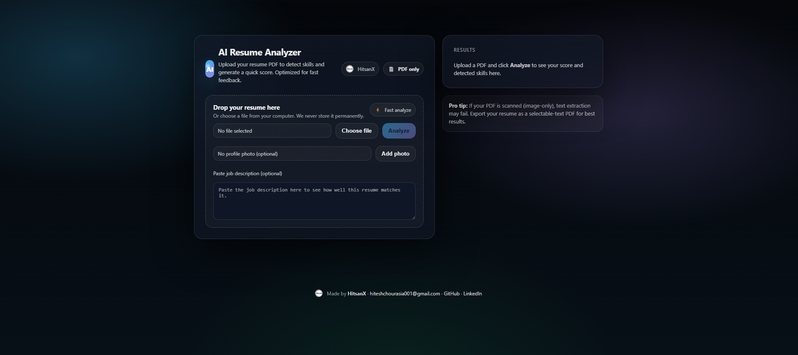
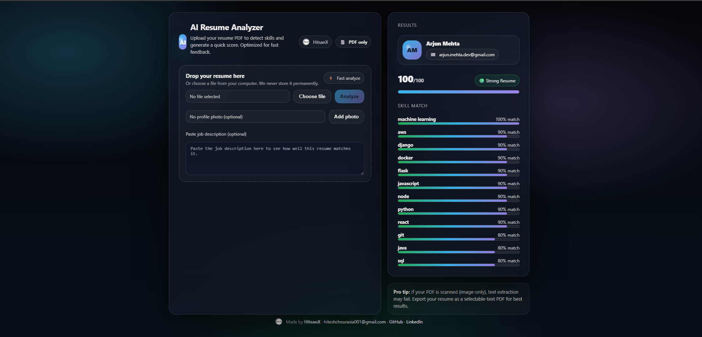

# AI Resume Analyzer

<p align="center">
  
</p>

<h1 align="center">🤖 AI Resume Analyzer</h1>

<p align="center">
AI-powered Resume Analysis & Job Matching System  
<br>
Built by <b>Hitesh Chourasia</b> | Founder @ HitSanX
</p>

<p align="center">
  
  
  
  
</p>

---

## 🚀 Project Overview

AI Resume Analyzer is a modern full-stack web application that:

- 📄 Uploads Resume (PDF)
- 🧠 Detects Technical Skills
- 📊 Generates Resume Score (0–100)
- 📈 Displays Skill Match Percentage
- 📝 Matches Resume Against Job Description
- 🌙 Modern Glassmorphism UI

---

## 🎥 Demo Preview

<p align="center">
  
</p>

---

## 🖼 Interface Screenshots

### 🔹 Upload Interface
<p align="center">
  
</p>

### 🔹 Result Dashboard
<p align="center">
  
</p>

---

## 🛠 Tech Stack

### 💻 Frontend
- HTML5  
- CSS3 (Custom Modern UI)  
- JavaScript  

### ⚙ Backend
- Python  
- Flask  

### 🧠 Processing Logic
- PDF Text Extraction  
- Skill Detection Engine  
- Resume Scoring Algorithm  
- Job Description Matching  

---

## 📂 Project Structure


Ai-Resume-Analyzer/
│
├── app.py
├── resume_analyzer.py
├── requirements.txt
├── Procfile
├── runtime.txt
│
├── test-images/
│ ├── demo.gif
│ ├── logo.png
│ ├── upload-ui.png
│ ├── result-dashboard.png
│
├── templates/
│ └── index.html
│
└── README.md


---

## ⚡ Run Locally

```bash
git clone https://github.com/HiteshArya10/Ai-Resume-Analyzer
cd Ai-Resume-Analyzer
pip install -r requirements.txt
python app.py

Then open:

http://127.0.0.1:5000
🎯 Future Improvements

🔥 NLP similarity scoring (TF-IDF / spaCy)

📊 ATS compatibility score

📈 Resume improvement suggestions

🔐 User authentication

☁ Cloud deployment (AWS / Render)

💰 SaaS expansion under HitSanX

👨‍💻 Author

Hitesh Chourasia
Founder @ HitSanX
AI/ML & Full Stack Developer

📧 hiteshchourasia001@gmail.com

⭐ If you like this project, consider giving it a star!
